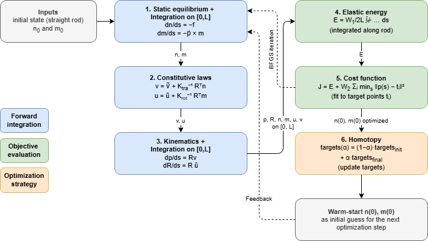
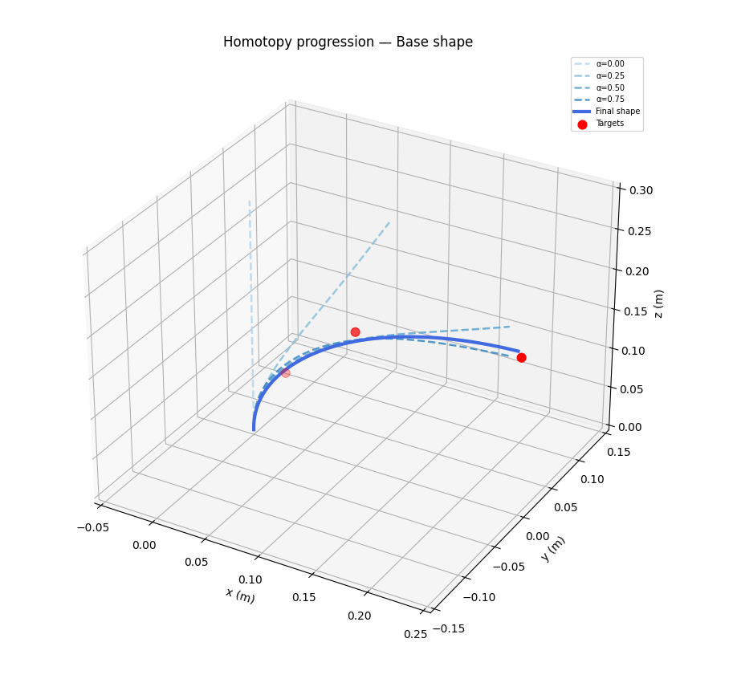
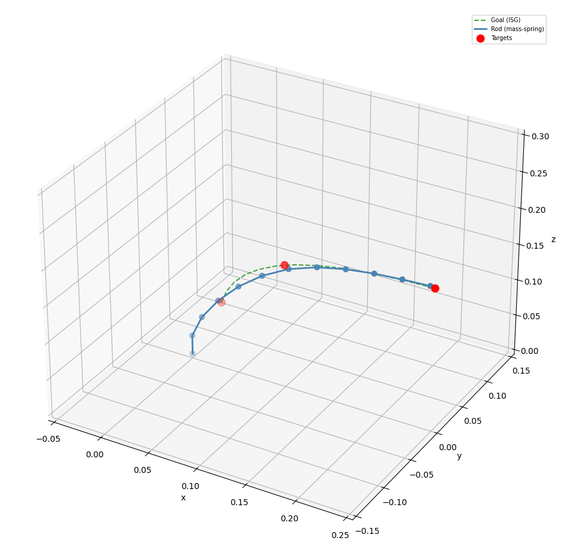
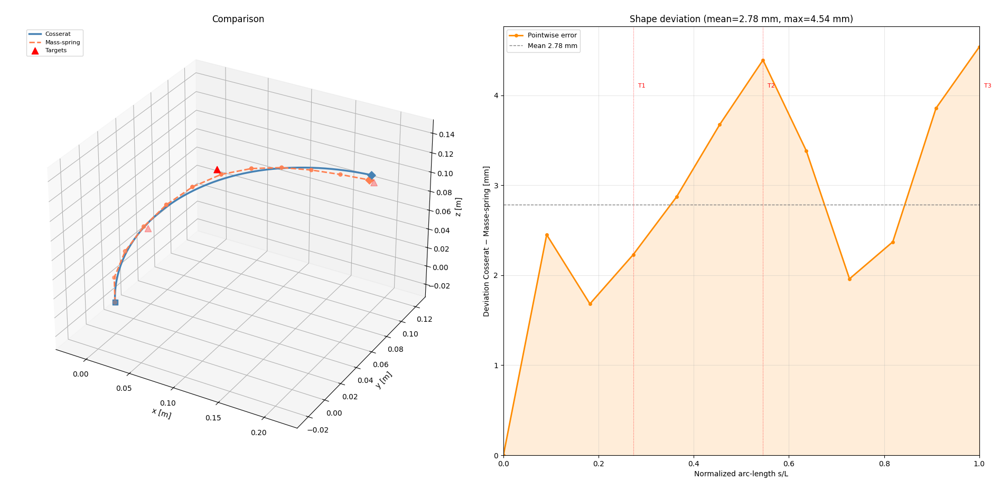

# Model-Based Shape Optimization of Deformable Linear Objects via Robotic Manipulation

**Research Practice - Technical University of Munich**  
Remy Tribout - May 2026

---

## Overview

This project studies the shape control of **Deformable Linear Objects (DLOs)**, such as cables, elastic rods, or flexible tools, in robotic manipulation. Unlike rigid objects, DLOs have a high-dimensional configuration space and nonlinear mechanics: a small change in boundary actuation can produce a complex global deformation.

The main difficulty is the trade-off between **model accuracy** and **computational efficiency**:

- High-fidelity models, such as the **Cosserat rod model**, describe the continuous mechanics of the rod accurately, but are more expensive to solve.
- Simplified models, such as a **mass-spring representation**, are faster and easier to optimize, but only approximate the real deformation.

The current objective is to use the simplified model as a **warm start** for the high-fidelity Cosserat optimization. The mass-spring model provides a fast approximate shape or tip pose that should lie close to the desired solution. This initialization can help the Cosserat optimizer start in the right basin of convergence and reduce, or eventually replace, the expensive homotopy strategy.

---

## Project Structure

A concise project structure note is provided in [`docs/project_structure.pdf`](docs/project_structure.pdf). It summarizes the planned scope of the research practice, including the baseline rod optimization approach, the possible integration of the MATLAB toolbox, the use of simplified models for initialization, and the evaluation criteria.

---

## Current State of the Project

Two shape optimization pipelines have been implemented:

1. `src/cosserat.py` - optimization with a continuous Cosserat rod model.
2. `src/mass_spring.py` - optimization with a discrete mass-spring model.

The first results are stored in `results/` and compare the optimized shapes obtained with both models for several target configurations. These comparisons are now used to evaluate whether the mass-spring solution is accurate enough to initialize the Cosserat optimization.

---

## Cosserat Rod Optimization

The Cosserat model represents the DLO as a continuous elastic rod parameterized by its arc length `s`.

The rod state contains:

- the centerline position `p(s)`,
- the orientation frame `R(s)`,
- the internal force `n(s)`,
- the internal moment `m(s)`,
- the shear/extension strain `v(s)`,
- the bending/torsion strain `u(s)`.

The implementation integrates the static Cosserat equations along the rod:

- `dp/ds = R v`
- `dR/ds = R hat(u)`
- `dn/ds = -f_ext`
- `dm/ds = -dp/ds x n`

The full optimization pipeline is summarized below. The editable diagram is available in `docs/cosserat_pipeline.drawio`.



The unknown control variables are the initial internal force and moment at the clamped end:

```text
x = [n(0), m(0)]
```

For a set of 3D target points, the optimizer minimizes a cost function combining:

- elastic deformation energy,
- distance between the rod centerline and the target points.

A **homotopy / continuation strategy** is currently used to improve convergence. Instead of optimizing directly from the straight rod to the final target configuration, the targets are progressively moved from an initial straight configuration to their final positions. The solution of each step is used as the initialization for the next one.

This strategy is robust, but it is also expensive because it requires solving many intermediate optimization problems. A main direction of the project is therefore to replace this multi-step continuation with a better initial guess obtained from the mass-spring model.

Example result:



The Cosserat optimization also extracts the final tip pose, force, moment, and orientation. This information can be used as an interface toward a robot end-effector, for example a Franka Emika Panda.


---

## Mass-Spring Optimization

The mass-spring model is a simplified discrete approximation of the DLO. The rod is represented by `N = 12` nodes connected by elastic segments.

The first node is clamped at the origin, and the initial tangent direction is imposed by fixing the second node along the `z` axis. The remaining nodes are optimized.

The model energy contains two terms:

- **stretching energy**, penalizing changes in segment length,
- **bending energy**, penalizing changes in angle between consecutive segments.

The current implementation uses:

```text
E_total = W1 * E_elastic + W2 * E_targets
```

where `E_targets` is the squared distance from each target point to the closest node of the discrete rod.

The target points are first resampled into a desired discrete curve using cubic splines. An **Intermediate Shape Generation (ISG)** step then creates intermediate configurations between the straight rod and the desired shape. These intermediate configurations make the optimization more stable, similarly to the homotopy strategy used in the Cosserat pipeline.

Example result:



The mass-spring pipeline also estimates the final tip pose from the last two nodes. This gives an approximate end-effector pose that can be used to initialize the Cosserat optimization closer to the final solution.

---

## First Results

The current experiments evaluate both models on several target configurations:

- `targets1` - base 3D shape,
- `targets2` - C-shape,
- `targets3` - S-shape.

The Cosserat solver produces smooth continuous shapes and serves as the high-fidelity reference. The mass-spring solver produces a coarser but computationally simpler approximation of the same target shape.

For the first target configuration, the comparison between both optimized shapes shows that the mass-spring model follows the Cosserat result closely:



For `targets1`, the measured deviation between the Cosserat and mass-spring centerlines is:

```text
mean error = 2.78 mm
max error  = 4.54 mm
```

This is a promising first result: the simplified model captures the main deformation trend with millimeter-level error for this scenario. However, this comparison is still preliminary. The goal is not to replace the Cosserat model with the mass-spring model, but to use the mass-spring solution as a fast initialization for the more accurate Cosserat optimization.

---

## Planned Warm-Start Framework

The next step is to connect the two implemented models in a sequential optimization pipeline:

1. **Fast simplified optimization**  
   The mass-spring model solves the target shape optimization and outputs an approximate discrete shape and tip pose.

2. **Cosserat initialization**  
   The mass-spring result is converted into an initial guess for the Cosserat optimization, for example through the final tip pose, an approximate boundary wrench, or an interpolated centerline.

3. **Direct high-fidelity optimization**  
   The Cosserat optimizer starts from this mass-spring-based initialization instead of starting from the straight rod.

4. **Reduced or removed homotopy**  
   If the initialization is close enough to the final solution, the Cosserat optimization may converge with fewer continuation steps, or without homotopy.

5. **Benchmarking**  
   The resulting method is compared against the current Cosserat-only homotopy pipeline in terms of convergence, computation time, and final shape error.

The goal is to obtain an optimization algorithm faster than Cosserat alone, while keeping the final accuracy of the high-fidelity model.

---

## Repository Structure

```text
.
|-- docs/
|   |-- Preliminary_Slides.pdf
|   |-- Premilinary_Note.pdf
|   |-- cosserat_pipeline.drawio
|   `-- cosserat_pipeline.png
|-- results/
|   |-- cosserat_targets1.png
|   |-- cosserat_targets2.png
|   |-- cosserat_targets3.png
|   |-- mass-spring_targets1.png
|   |-- mass-spring_targets2.png
|   |-- mass-spring_targets3.png
|   |-- comparison_targets1.png
|   `-- robot_pose_from_cosserat.png
|-- src/
|   |-- cosserat.py
|   |-- mass_spring.py
|   |-- comparison.py
|   `-- robot_arm.py
`-- README.md
```

---

## Running the Code

The scripts are written in Python and use `numpy`, `scipy`, and `matplotlib`.

Run the Cosserat optimization:

```bash
python src/cosserat.py
```

Run the mass-spring optimization:

```bash
python src/mass_spring.py
```

Each script currently contains the model parameters and target points directly in the file. Future work could move these parameters to a shared configuration file to make comparisons between scenarios easier.

---

## References

[1] A. Artinian et al., *Optimal Cosserat-based deformation control for robotic manipulation of linear objects*, IEEE AIM, 2023.

[2] A. Artinian et al., *Closed-Loop Shape Control of Deformable Linear Objects Based on Cosserat Model*, IEEE RA-L, 2024.

[3] A. Govoni et al., *Performance Analysis of a Mass-Spring-Damper DLO Model in Robotic Simulation Frameworks*, arXiv, 2025.

[4] K. Almaghout et al., *Robotic co-manipulation of deformable linear objects for large deformation tasks*, Robotics and Autonomous Systems, 2024.

[5] F. Surmont, D. Coache et al., Geometrically exact static 3D Cosserat rods problem solved using a shooting method, International Journal of Non-Linear Mechanics, 2020, 119, 103330.

[6] Y. Yu, H. Yang, J. Tan, X. Wang, A Hybrid Force-Position Strategy for Shape Control of Deformable Linear Objects With Graph Attention Networks, 2023.

[7] C. Alessi, C. Agabiti, D. Caradonna, C. Laschi, F. Renda, E. Falotico et al., Rod models in continuum and soft robot control: a review, SAGE Journals, 2024, 1–31, doi:10.1177/ToBeAssigned.
