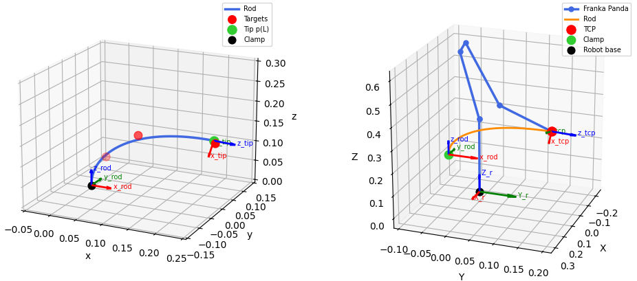

# Feedback-Based Shape Control of Deformable Linear Objects via a Simplified Model

**Research Practice – Technical University of Munich**  
Rémy Tribout · April 2026

---

## Overview

This project addresses the problem of shape control of **Deformable Linear Objects (DLOs)** — such as cables or flexible rods — in robotic manipulation. DLOs are difficult to model due to their nonlinear continuum mechanics and high-dimensional configuration space.

The core challenge is a trade-off between **model accuracy** and **computational efficiency**:
- High-fidelity models (e.g. Cosserat rod) are physically accurate but expensive to solve.
- Simplified models (e.g. mass-spring) are fast but less accurate.

This work aims to bridge this gap through a **feedback-based correction framework**: a simplified model generates a fast initial actuation, which is then iteratively corrected using a high-fidelity reference.

---

## Preliminary Work

A shape optimization algorithm has been implemented based on the **Cosserat rod model**:

- The rod is modeled by its centerline position `p(s)`, orientation `R(s)`, local strain measures `u(s)` and `v(s)`, and internal forces and moments `n(s)` and `m(s)`.
- Given a set of 3D target points, the algorithm optimizes the boundary conditions `n(0)` and `m(0)` at the clamped end to minimize a cost function combining elastic energy and distance to targets.
- A **homotopy (continuation) strategy** is used to ensure convergence from the straight rod to the target shape.
- The optimized tip pose (position, orientation, force, moment) is mapped to a **Franka Emika Panda** robot via inverse kinematics.

---

## Proposed Approach

The main goal of this research practice is to develop a **feedback-based correction loop** between a simplified model and the Cosserat ground truth:

1. **Feedforward prediction** – a mass-spring model solves the shape optimization and produces an approximate tip pose.
2. **High-fidelity evaluation** – the tip pose is applied to the Cosserat model to evaluate the resulting shape.
3. **Feedback correction** – the shape error is propagated back through a local actuation-to-shape mapping to update the control input.

This loop iterates until convergence, maintaining computational efficiency while recovering physical accuracy.

### Possible Extensions
- Coupling the rod tip pose directly with the robot end-effector.
- Replacing the Cosserat ground truth with a simulated perception model, bringing the framework closer to a real-world scenario.

---

## References

[1] A. Artinian et al., *Optimal Cosserat-based deformation control for robotic manipulation of linear objects*, IEEE AIM, 2023.

[2] A. Artinian et al., *Closed-Loop Shape Control of Deformable Linear Objects Based on Cosserat Model*, IEEE RA-L, 2024.

[3] A. Govoni et al., *Performance Analysis of a Mass-Spring-Damper DLO Model in Robotic Simulation Frameworks*, arXiv, 2025.

[4] K. Almaghout et al., *Robotic co-manipulation of deformable linear objects for large deformation tasks*, Robotics and Autonomous Systems, 2024.
